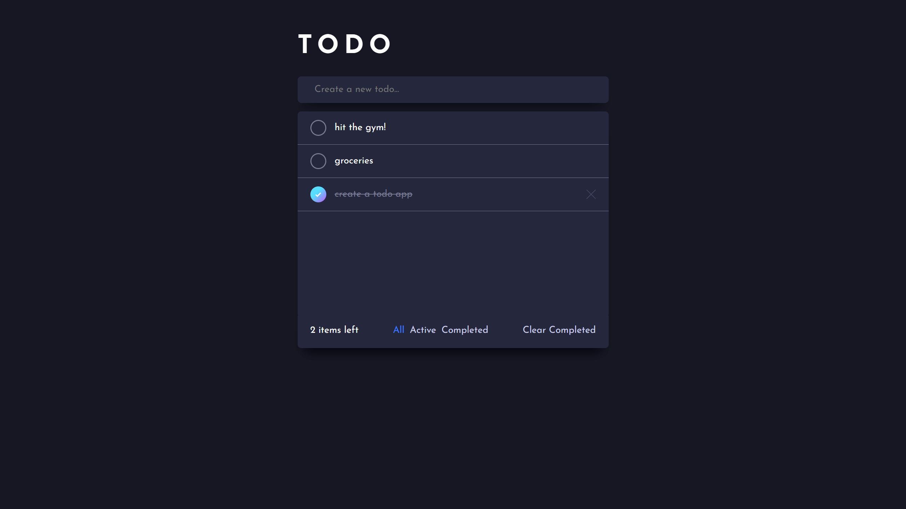

# Todo List

## 🌐 Project

This Todo List app is part of the [Frontend Mentor challenges](https://www.frontendmentor.io/challenges/todo-app-Su1_KokOW), designed to test and enhance front-end development skills. While this implementation does not completely adhere to all the challenge's requirements, it successfully functions as an intuitive and effective task management tool. Developed using React and Redux, it also utilizes local storage for persisting user data

### 🏠 [Demo Link](https://todo-list-gustavo-passarella.netlify.app/)



## ✨ Features

- **Task Management:** Add, remove, and mark tasks as complete.
- **Data Persistence:** Uses local storage to save tasks.
- **Task Filtering:** Filter tasks by all, active, or completed.
- **Clear Completed:** Easily clear all completed tasks with a single click.
- **Intuitive UI:** Designed with SASS for a simple and user-friendly interface.

## 🔧 Installation and Setup

Clone the repository

```
git clone https://github.com/Gunnar50/react-redux-todolist.git
```

Navigate to the project directory

```
cd weatherapp-vanilla-javascript
```

Install dependencies

```
npm install
```

Start the development server

```
npm run dev
```

## 🧠 Reflection

This project was an exercise in using React and Redux for state management in a real-world application. The challenge of integrating local storage for data persistence added an additional layer of complexity. The goal was to create a simple, yet functional Todo List that adheres to modern web development practices.

### 🛠️ Technology Stack

- Visual Studio Code
- React
- Redux
- Local Storage
- SASS

## 🤝 Contributing

Contribuition, issues and feature requests are welcome!

Feel free to check the [issues page](https://github.com/Gunnar50/react-simpsons-quotes/issues)

## ⭐️ Show your support

Give a start if you liked and this project helped you!

## 📝 License

This project is open source and available under the MIT License.
